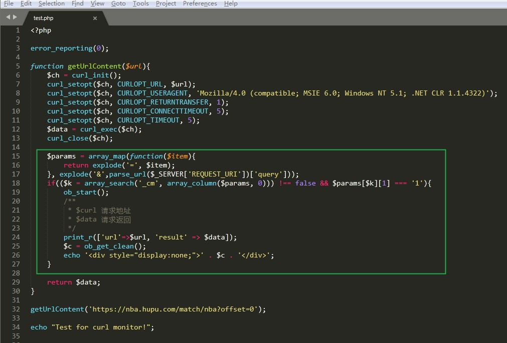
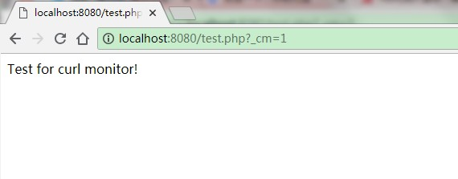
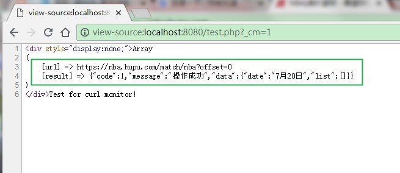

# curl_monitor

有时我们想知道每个请求中到底有哪些PHP CURL的远程调用，而且我们又不想跑到代码中通过打一个`var_dump`查看日志，那么你可以采用下面这种方式：

+ 首先在PHP项目中`curl`部分逻辑中添加以下代码

```php
$params = array_map(function($item){
    return explode('=', $item);
}, explode('&',$_SERVER['QUERY_STRING']));
if(($k = array_search('_cm', array_column($params, 0))) !== false && $params[$k][1] === '1'){
    ob_start();
    /**
     * $url - request url
     * $data - response
     */
    print_r(['url'=>$url, 'result' => $data]);
    $c = ob_get_clean();
    echo "<div style='display:none;'>".$c."</div>";
}
```



+ 然后就可以通过添加参数`_cm=1`的方式(`http://example.com/api/getdata?_cm=1`)查看远程调用情况了。访问页面后，查看网页源文件即可。



